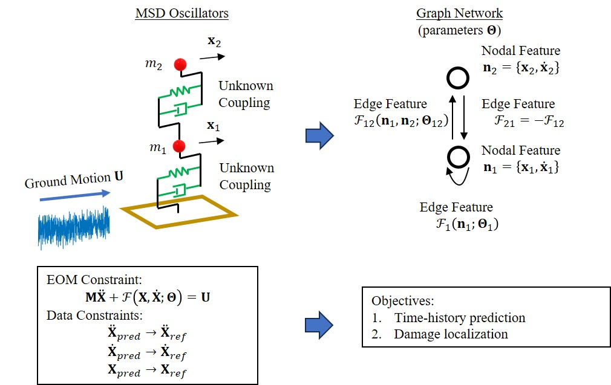

# GraphOscillators
**Title**

Graph Oscillators: Physics-guided Graph Modeling of Mass-Spring-Damper Systems for Trajectory Prediction and Damage Localization

**Authors**  
Zhao Chen* (Southeast University)  
Nan Wang (Northeastern University)  
Hao Sun (Renmin University of China)

**Abstract**  
Recognizing that a multiple-degree-of-freedom mass-spring-damper system can be viewed as a group of connected nodes, this paper presents a novel computational framework that learns such coupled oscillations by a graph, a mathematical structure describing pairwise connections between objects. Further reinforced by an incomplete equation of motion, distributed neural networks and an anti-symmetric coupling constraint, we can learn unknown coupling mechanisms (or nodal interactions in the language of graph models) using limited data. The proposed physics-data-hybrid method demonstrates a promising predictive capability even for unseen control inputs, outperforming three black-box and grey-box counterparts in synthetic and experimental studies. In addition to its predictive capability, the distributed parameterization of nodal interactions allows us to identify local anomalies by evaluating updates after short transfer learning. While limits of the current method exist, it displays the potential of a generalizable and interpretable meta-model for predicting nonlinear trajectories and identifying the system's status.

**Graphical Abstract**  

Codes will be available soon.
